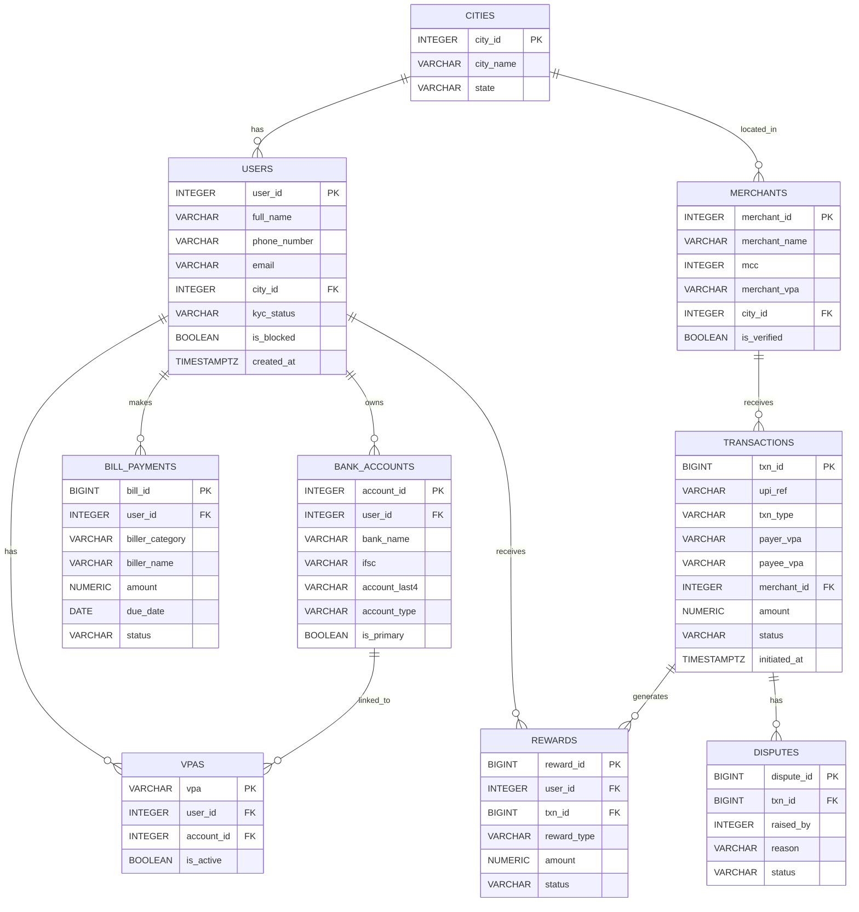

# Google Pay Digital Payments - ER Diagram

```mermaid
erDiagram

    CITIES ||--o{ USERS : has
    CITIES ||--o{ MERCHANTS : located_in

    USERS ||--o{ BANK_ACCOUNTS : owns
    USERS ||--o{ VPAS : has
    USERS ||--o{ BILL_PAYMENTS : makes
    USERS ||--o{ REWARDS : receives

    BANK_ACCOUNTS ||--o{ VPAS : linked_to

    MERCHANTS ||--o{ TRANSACTIONS : receives

    TRANSACTIONS ||--o{ DISPUTES : has
    TRANSACTIONS ||--o{ REWARDS : generates

    CITIES {
        INTEGER city_id PK
        VARCHAR city_name
        VARCHAR state
    }

    USERS {
        INTEGER user_id PK
        VARCHAR full_name
        VARCHAR phone_number
        VARCHAR email
        INTEGER city_id FK
        VARCHAR kyc_status
        BOOLEAN is_blocked
        TIMESTAMPTZ created_at
    }

    BANK_ACCOUNTS {
        INTEGER account_id PK
        INTEGER user_id FK
        VARCHAR bank_name
        VARCHAR ifsc
        VARCHAR account_last4
        VARCHAR account_type
        BOOLEAN is_primary
    }

    MERCHANTS {
        INTEGER merchant_id PK
        VARCHAR merchant_name
        INTEGER mcc
        VARCHAR merchant_vpa
        INTEGER city_id FK
        BOOLEAN is_verified
    }

    VPAS {
        VARCHAR vpa PK
        INTEGER user_id FK
        INTEGER account_id FK
        BOOLEAN is_active
    }

    TRANSACTIONS {
        BIGINT txn_id PK
        VARCHAR upi_ref
        VARCHAR txn_type
        VARCHAR payer_vpa
        VARCHAR payee_vpa
        INTEGER merchant_id FK
        NUMERIC amount
        VARCHAR status
        TIMESTAMPTZ initiated_at
    }

    BILL_PAYMENTS {
        BIGINT bill_id PK
        INTEGER user_id FK
        VARCHAR biller_category
        VARCHAR biller_name
        NUMERIC amount
        DATE due_date
        VARCHAR status
    }

    DISPUTES {
        BIGINT dispute_id PK
        BIGINT txn_id FK
        INTEGER raised_by
        VARCHAR reason
        VARCHAR status
    }

    REWARDS {
        BIGINT reward_id PK
        INTEGER user_id FK
        BIGINT txn_id FK
        VARCHAR reward_type
        NUMERIC amount
        VARCHAR status
    }
```
